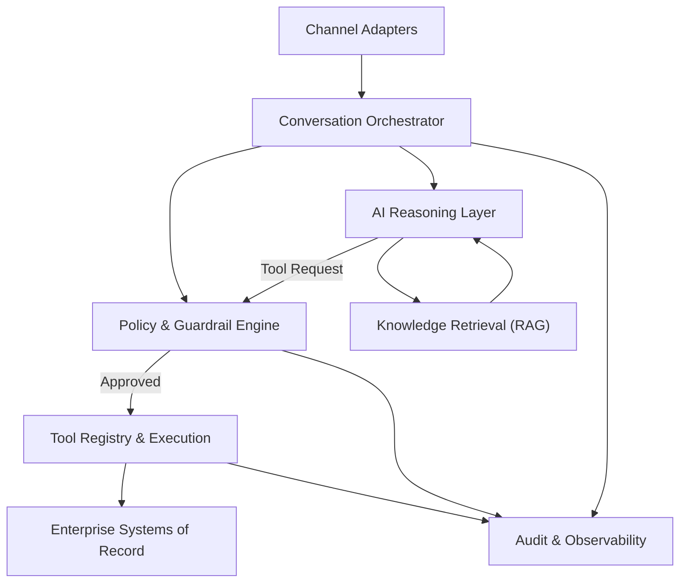

# Article 2 — C4 Container  
## Inside the AI Assistant Platform

---

## Why this document exists
After defining **who interacts with the AI Assistant Platform and where its boundaries lie**, the next architectural responsibility is to explain:

- what capabilities must exist *inside* the platform
- why each capability is necessary
- what risks each capability is designed to contain

This document does **not** describe implementation details.  
It describes **structural responsibility and control boundaries** required to operate AI safely in a healthcare enterprise.

---

## Problem being addressed
Without internal structure, AI assistant platforms tend to evolve into:

- tightly coupled AI-to-system integrations
- inconsistent policy enforcement
- duplicated logic across channels
- unclear ownership of failures
- uncontrolled cost and behavior drift

In regulated environments, these issues are not technical inconveniences — they become **compliance and operational risks**.

This container view exists to **separate concerns and enforce control points** inside the AI Assistant Platform.

---

## Container-level responsibilities
At container level, the AI Assistant Platform must:

- manage conversation state consistently across channels
- constrain and govern AI behavior
- separate reasoning from execution
- protect enterprise systems of record
- provide observability and auditability
- support human escalation paths

These responsibilities **cannot be fulfilled by a single component**.

---

## Container decomposition (logical)

The AI Assistant Platform is decomposed into the following logical containers:

1. Channel Adapters
2. Conversation Orchestrator
3. Policy & Guardrail Engine
4. AI Reasoning Layer
5. Tool Registry & Execution Layer
6. Knowledge Retrieval (RAG) Service
7. Audit & Observability Services

Each container exists to address a **specific class of risk**.

---

## Container descriptions (WHY-focused)

### 1. Channel Adapters
**Why this exists**  
Voice, chat, and agent-desktop channels impose different constraints (latency, interaction style, interruption handling).  
Channel-specific logic must not leak into AI behavior.

**Responsibility**
- normalize inputs and outputs
- manage channel-specific session mechanics
- enforce channel-level constraints

**Explicit non-responsibilities**
- AI reasoning
- business logic
- enterprise system access

---

### 2. Conversation Orchestrator
**Why this exists**  
AI assistants must make decisions across multiple steps while preserving context, state, and control boundaries.

Direct AI-to-system flows create uncontrolled autonomy.

**Responsibility**
- manage conversation state
- route intents to appropriate capabilities
- determine when AI may proceed, pause, or escalate
- coordinate between reasoning, tools, and humans

**Architectural position**
This is the **central control plane** of the assistant.

---

### 3. Policy & Guardrail Engine
**Why this exists**  
Model-level safeguards are insufficient for enterprise governance.

Policies must be **explicit, testable, and independently owned**.

**Responsibility**
- enforce role-based permissions
- apply intent restrictions
- implement confidence thresholds
- block disallowed actions
- apply compliance rules (e.g., PHI handling)

**Key principle**
If policy is implicit, it will be bypassed.

---

### 4. AI Reasoning Layer
**Why this exists**  
AI reasoning must be isolated to prevent:
- direct access to enterprise systems
- uncontrolled side effects
- hidden decision logic

**Responsibility**
- interpret user intent
- generate candidate actions or responses
- request tool usage through formal interfaces

**Explicit non-responsibilities**
- executing actions
- persisting enterprise data
- enforcing policy

AI proposes. It does not decide.

---

### 5. Tool Registry & Execution Layer
**Why this exists**  
Enterprise systems must never be exposed directly to AI reasoning.

This layer acts as a **capability firewall**.

**Responsibility**
- define allowable tools per role and intent
- authenticate and authorize tool usage
- enforce rate limits and retries
- execute calls against enterprise systems
- return structured results

**Architectural rule**
If a capability is not registered as a tool, it does not exist for AI.

---

### 6. Knowledge Retrieval (RAG) Service
**Why this exists**  
Some information is **knowledge-based**, not transactional.

Embedding enterprise policies directly into prompts is:
- unmaintainable
- non-auditable
- prone to drift

**Responsibility**
- retrieve approved enterprise knowledge
- apply metadata filters (plan, state, effective date)
- support citation and grounding

**Constraint**
RAG is used only where no system of record exists.

---

### 7. Audit & Observability Services
**Why this exists**  
AI failures are often silent.

Without structured telemetry, incidents cannot be investigated.

**Responsibility**
- log prompts, responses, and tool usage
- track policy decisions and escalations
- enable post-incident review
- support compliance audits

**Architectural stance**
An unauditable AI interaction is a system defect.

---

## C4 Container Diagram


---
```mermaid
flowchart TB
    A[Channel Adapters] --> B[Conversation Orchestrator]
    B --> C[Policy & Guardrail Engine]
    B --> D[AI Reasoning Layer]
    D -->|Tool request| C
    C -->|Approved| E[Tool Registry & Execution]
    E --> F[Enterprise Systems of Record]
    D <--> G[Knowledge Retrieval (RAG)]
    B --> H[Audit & Observability]
    C --> H
    E --> H
```
---
