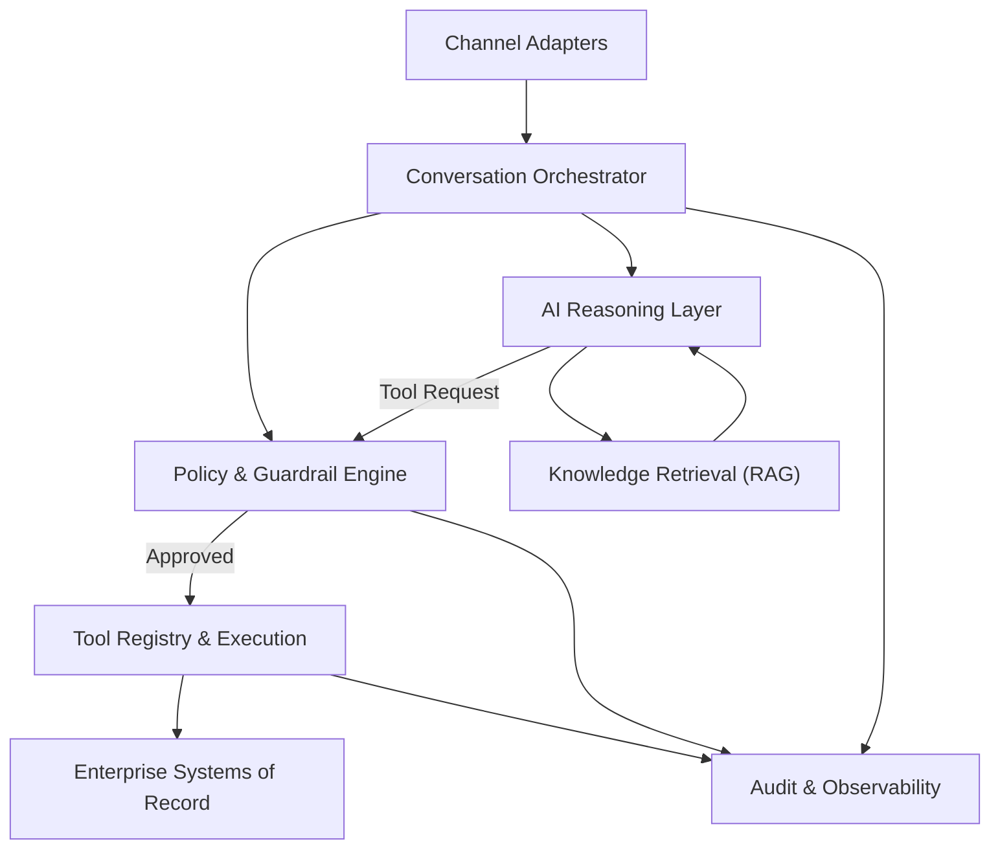

# Article 2 - C4 Container  
## Inside the AI Assistant Platform

---

> **Start here / Next read:**  
> - You are reading: **C4 Container**  
> - Next: [Data Strategy](../03-data-strategy/rag-vs-systems-of-record.md)  
> - Then: [Agent Patterns](../04-agent-patterns/bounded-autonomy.md)

## Why this document exists
After defining **who interacts with the AI Assistant Platform and where its boundaries lie**, the next architectural responsibility is to explain:

- what capabilities must exist *inside* the platform
- why each capability is necessary
- what risks each capability is designed to contain

This document does **not** describe implementation details.  
It describes **structural responsibility and control boundaries** required to operate AI safely in a healthcare enterprise.

---

## Problem being addressed
Without internal structure, AI assistant platforms tend to evolve into:

- tightly coupled AI-to-system integrations
- inconsistent policy enforcement
- duplicated logic across channels
- unclear ownership of failures
- uncontrolled cost and behavior drift

In regulated environments, these issues are not technical inconveniences - they become **compliance and operational risks**.

This container view exists to **separate concerns and enforce control points** inside the AI Assistant Platform.

---

## Container-level responsibilities
At container level, the AI Assistant Platform must:

- manage conversation state consistently across channels
- constrain and govern AI behavior
- separate reasoning from execution
- protect enterprise systems of record
- provide observability and auditability
- support human escalation paths

These responsibilities **cannot be fulfilled by a single component**.

---

## Container decomposition (logical)

The AI Assistant Platform is decomposed into the following logical containers:

1. Channel Adapters
2. Conversation Orchestrator
3. Policy & Guardrail Engine
4. AI Reasoning Layer
5. Tool Registry & Execution Layer
6. Knowledge Retrieval (RAG) Service
7. Audit & Observability Services

Each container exists to address a **specific class of risk**.

---

## Container descriptions (WHY-focused)

### 1. Channel Adapters
**Why this exists**  
Voice, chat, and agent-desktop channels impose different constraints (latency, interaction style, interruption handling).  
Channel-specific logic must not leak into AI behavior.

**Responsibility**
- normalize inputs and outputs
- manage channel-specific session mechanics
- enforce channel-level constraints

**Explicit non-responsibilities**
- AI reasoning
- business logic
- enterprise system access

---

## Channel considerations (voice vs chat)

Voice and chat share the same core platform, but user expectations and risk controls differ. The architecture treats the channel as an input/output adapter while enforcing consistent policy and audit controls.

### 1) Latency expectations and progressive responses
- **Chat:** users tolerate longer responses when tool-backed; responses can be structured and cite sources.
- **Voice:** users expect fast acknowledgement. The system should support:
  - immediate acknowledgement within ~1–2 seconds
  - progressive updates (“Let me check that…”, “Still working…”) when tools are slow
  - safe fallback messaging when timeouts occur

**Platform implication:** the orchestrator should support asynchronous tool calls and progressive response assembly for voice.

### 2) Confirmation patterns (reduce high-risk mistakes)
Voice channels are more error-prone (ASR/STT errors). For medium/high-risk actions:
- require explicit confirmation (“Did you mean claim 12345?”)
- repeat back key entities (claimId, date range) before tool execution
- use HITL gating for high-risk intents as defined by policy

**Platform implication:** entity confirmation steps are modeled as workflow states, not ad-hoc prompt text.

### 3) STT/ASR error handling and ambiguity controls
- treat low-confidence transcripts as **ambiguous** and trigger:
  - clarification questions
  - fallback to chat (send link) or HITL when needed
- log transcript confidence as an input to risk tiering and escalation

### 4) Privacy and environment risks (voice-specific)
Voice interactions may occur in non-private environments:
- avoid reading sensitive details aloud by default
- provide “privacy-safe” summaries unless the user explicitly requests details and is authenticated
- prefer sending sensitive details to chat or secure portal links (where applicable)

### 5) Audit and trace consistency
Both channels must produce consistent traces:
- intent + confidence
- policy allow/deny + reasons
- tool calls and outcomes
- escalation/HITL events
- final response

### 6) Safe defaults
- For voice, default to **minimal disclosure** and **confirmation-first** for member-specific information.
- For chat, default to **evidence-first** and **cited explanations**.

---

### 2. Conversation Orchestrator
**Why this exists**  
AI assistants must make decisions across multiple steps while preserving context, state, and control boundaries.

Direct AI-to-system flows create uncontrolled autonomy.

**Responsibility**
- manage conversation state
- route intents to appropriate capabilities
- determine when AI may proceed, pause, or escalate
- coordinate between reasoning, tools, and humans

**Architectural position**
This is the **central control plane** of the assistant.

---

### 3. Policy & Guardrail Engine
**Why this exists**  
Model-level safeguards are insufficient for enterprise governance.

Policies must be **explicit, testable, and independently owned**.

**Responsibility**
- enforce role-based permissions
- apply intent restrictions
- implement confidence thresholds
- block disallowed actions
- apply compliance rules (e.g., PHI handling)

**Key principle**
If policy is implicit, it will be bypassed.

---

### 4. AI Reasoning Layer
**Why this exists**  
AI reasoning must be isolated to prevent:
- direct access to enterprise systems
- uncontrolled side effects
- hidden decision logic

**Responsibility**
- interpret user intent
- generate candidate actions or responses
- request tool usage through formal interfaces

**Explicit non-responsibilities**
- executing actions
- persisting enterprise data
- enforcing policy

AI proposes. It does not decide.

---

### 5. Tool Registry & Execution Layer
**Why this exists**  
Enterprise systems must never be exposed directly to AI reasoning.

This layer acts as a **capability firewall**.

**Responsibility**
- define allowable tools per role and intent
- authenticate and authorize tool usage
- enforce rate limits and retries
- execute calls against enterprise systems
- return structured results

**Architectural rule**
If a capability is not registered as a tool, it does not exist for AI.
---

## Tool contract standard (enterprise)

Tools are the controlled bridge between the assistant and downstream systems-of-record/workflows. To prevent tool misuse, privilege creep, and brittle integrations, every tool onboarded into the platform must meet a consistent contract.

> **Rule:** The model never calls tools directly. Tools are invoked only through the orchestrator + policy gate + tool registry.

### 1) Required interface (schema + semantics)
Every tool must publish a versioned schema (e.g., JSON Schema / OpenAPI) including:
- **Name + version:** `claims.lookup.v1`
- **Purpose statement:** what this tool is allowed to do (and not do)
- **Inputs:** strongly typed fields with allowed ranges/patterns
- **Outputs:** strongly typed response (no free-form blobs where possible)
- **Error model:** standardized error codes + retryability
- **Side effects:** explicit declaration (`read-only` vs `transactional`)

**Design principle:** prefer small, purpose-built tools over “万能” query tools.

### 2) Classification (must be declared)
Each tool must declare:
- **Tool type:** `READ_ONLY` or `TRANSACTIONAL`
- **Data sensitivity:** `PUBLIC / INTERNAL / PII / PHI`
- **Risk tier:** `LOW / MEDIUM / HIGH` (used by policy)
- **Idempotency:** `IDEMPOTENT` (safe retries) or `NON_IDEMPOTENT` (approval required)
- **Max scope:** what records/fields it can access (purpose limitation)

### 3) Enforcement rules (platform guarantees)
The platform must enforce (outside the LLM):
- **Deny-by-default allowlisting:** intent → allowed tools mapping
- **Parameter validation:** reject queries outside schema or exceeding scope
- **Least privilege credentials:** scoped token per call (no shared “god token”)
- **Rate limits & burst control:** per-user and per-tool quotas
- **Timeouts & circuit breakers:** stop runaway retries and cascading failures
- **Safe fallbacks:** degrade to KB-only or HITL-first when tools fail

### 4) Audit requirements (mandatory fields)
Every tool call must emit an auditable record containing:
- `correlationId` (trace id across the request)
- `requestId` (unique tool invocation id)
- `timestamp` (start/end)
- `actor` (user identity + role; session/assistant identity)
- `intent` + `riskTier`
- `policyDecision` (allow/deny + reason)
- `toolName` + `toolVersion`
- `inputSummary` (minimized; avoid PHI payloads in logs)
- `outputSummary` (minimized; avoid PHI payloads in logs)
- `result` (success/failure + error code)
- `approvalId` (if HITL approval was required)

### 5) Error taxonomy (standardize for orchestration)
Tools must return normalized errors so the orchestrator can decide:
- `VALIDATION_ERROR` (non-retryable; fix input)
- `AUTHZ_DENIED` (non-retryable; policy/RBAC)
- `NOT_FOUND` (non-retryable; missing entity)
- `CONFLICT` (non-retryable; state mismatch)
- `RATE_LIMITED` (retryable with backoff)
- `TIMEOUT` (retryable with cap; may trigger degrade mode)
- `DEPENDENCY_FAILURE` (retryable with backoff; may trip circuit breaker)
- `UNKNOWN` (treated as failure; escalate if repeated)

### 6) Safe query design (prevent exfiltration)
To reduce data exposure and “dump” queries:
- Prefer **targeted** endpoints (lookup by claimId/memberId with role checks)
- Enforce **field-level filtering** (return only what is needed)
- Apply **row limits** and **purpose limitation**
- Block “export all” patterns by policy

### 7) Approval requirements for transactional tools
Transactional tools (create/update actions) must support:
- **pre-execution check:** validate proposed action without executing (dry-run)
- **approval binding:** execute only when a valid `approvalId` is supplied
- **idempotency key:** prevent duplicate execution during retries

### 8) Onboarding checklist (definition of done)
A tool is “onboarded” only when:
- schema is versioned and validated
- allowlist mapping exists (intent → tool + approvals)
- scopes and credentials are least privilege
- audit fields are emitted and verified
- timeouts, rate limits, and circuit breakers are configured
- failure behaviors and degrade paths are documented

---

---

### 6. Knowledge Retrieval (RAG) Service
**Why this exists**  
Some information is **knowledge-based**, not transactional.

Embedding enterprise policies directly into prompts is:
- unmaintainable
- non-auditable
- prone to drift

**Responsibility**
- retrieve approved enterprise knowledge
- apply metadata filters (plan, state, effective date)
- support citation and grounding

**Constraint**
RAG is used only where no system of record exists.

---

### 7. Audit & Observability Services
**Why this exists**  
AI failures are often silent.

Without structured telemetry, incidents cannot be investigated.

**Responsibility**
- log prompts, responses, and tool usage
- track policy decisions and escalations
- enable post-incident review
- support compliance audits

**Architectural stance**
An unauditable AI interaction is a system defect.

---

## C4 Container Diagram

---

