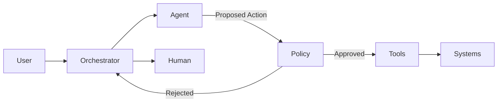

# Article 4 - Agent Patterns  
## Bounded Autonomy in Enterprise AI

---

> **Start here (Agent Patterns):**  
> - You are reading: **Bounded Autonomy**  
> - Next: [Planner-Executor](./planner-executor.md)  
> - Also: [Human-in-the-Loop (HITL)](./human-in-the-loop.md)

## Why this document exists
"Agent-based AI" is one of the most misunderstood concepts in enterprise systems.

In many implementations, agents are introduced as:
- autonomous actors
- long-running workflows
- systems that decide and act independently

In regulated environments such as healthcare, **unbounded autonomy is not innovation - it is risk**.

This document defines **bounded autonomy** as an architectural pattern that allows AI agents to assist, reason, and coordinate actions **without exceeding explicit decision authority**.

---

## Problem being addressed
Healthcare AI assistants are expected to:
- reason across multiple steps
- interact with several systems
- adapt to incomplete or ambiguous input

At the same time, they must:
- respect PHI boundaries
- avoid unauthorized actions
- remain auditable
- escalate correctly when risk increases

Without architectural constraints, agent systems tend to:
- accumulate hidden authority
- bypass policy enforcement
- create non-reproducible behavior
- fail silently

This article explains how **agent behavior is constrained by design**, not by intent.

---

## What an "agent" means in this architecture
In this reference architecture, an agent is defined as:

> A **reasoning component** that can propose actions, request tools, and coordinate multi-step flows **within explicitly defined limits**.

An agent is **not**:
- a system of record
- an autonomous decision-maker
- a replacement for business workflows
- a long-running background process with unchecked permissions

This definition intentionally narrows the scope of what "agent" means.

---

## The principle of bounded autonomy
Bounded autonomy is enforced through **four architectural boundaries**:

1. Scope boundaries  
2. Action boundaries  
3. Data boundaries  
4. Escalation boundaries  

Each boundary exists to control a specific failure mode.

---

## 1. Scope boundaries
**Why this boundary exists**  
Without scope constraints, agents tend to generalize beyond their intended purpose.

**Architectural decision**
- Each agent operates only within a predefined intent domain.
- Cross-domain reasoning requires orchestration approval.

**Example**
A "claims assistance" agent may explain claim status but cannot initiate appeals.

---

## 2. Action boundaries
**Why this boundary exists**  
Reasoning does not imply execution authority.

**Architectural decision**
- Agents may *request* actions.
- Only the orchestration + policy layers may *approve and execute* actions.

**Example**
An agent may request "create case", but cannot create one directly.

---

## 3. Data boundaries
**Why this boundary exists**  
Agents must not infer or fabricate transactional truth.

**Architectural decision**
- Agents access transactional data only through approved tools.
- Knowledge retrieval (RAG) is restricted to explanatory contexts.

**Example**
An agent may retrieve a denial reason code, but explanations are sourced separately and cited.

---

## Conversation state and memory policy

Agent behavior becomes risky when "memory" is treated as an unlimited, long-lived store. This architecture defines explicit rules for what the assistant may retain and how context is governed.

### 1) Memory types (what exists)
- **Turn context:** the current user message and immediate history (within the session)
- **Session state:** short-lived structured state (e.g., selected claimId, selected member context) valid only for the active session
- **Long-term memory (persistent):** cross-session personalization or "remembered facts" (disabled by default in regulated contexts)

### 2) Default stance (regulated-domain safe default)
- **Long-term memory is OFF by default.**
- The assistant may use **session state** only when it is:
  - explicitly required to complete a workflow
  - bounded in time (expires)
  - tied to authenticated user identity (no anonymous carryover)
- The assistant must not store PHI/PII in memory stores unless explicitly approved and controlled.

### 3) What may be stored in session state (examples)
Allowed:
- intent classification result (non-sensitive)
- workflow step pointer ("awaiting approval", "awaiting confirmation")
- non-sensitive preferences for formatting (e.g., "short answers")
- selected record identifiers **only if** they are already in the authenticated context and required for the flow

Not allowed by default:
- raw PHI payloads (diagnosis details, member records, etc.)
- full tool responses persisted beyond the turn
- passwords, tokens, secrets
- "free-form notes" derived from user text without provenance

### 4) Provenance and evidence rules
- Memory entries must be **attributable**:
  - derived from a tool response (with reference id), or
  - explicitly stated by the user within the same session
- The assistant must not "remember" inferred facts as truth.
- If evidence is missing, the system must re-verify via tools or escalate.

### 5) Memory poisoning and context integrity controls
To protect against context poisoning and prompt injection:
- treat user-supplied "facts" as untrusted until verified
- restrict what can be written into session state (structured schema only)
- keep a clear separation between:
  - user content
  - tool outputs
  - KB retrievals
  - policy decisions
- apply allowlists for context sources (no uncontrolled external text injection)

### 6) Expiration and retention
- Session state must expire automatically (e.g., minutes/hours) and be cleared at session end.
- Any retained logs/traces must follow data minimization and retention rules (see Security & Compliance).

### 7) HITL implications
For high-risk intents, the human reviewer should see:
- the current session state
- what sources contributed to it (user vs tool vs KB)
- any pending approvals and the rationale

See also: `06-security-compliance/security-and-compliance.md` (threat model + OWASP alignment).

---

## 4. Escalation boundaries
**Why this boundary exists**  
AI confidence is not a reliable proxy for correctness or risk.

**Architectural decision**
- Confidence thresholds and intent classification determine escalation.
- Certain intents always require human involvement.

**Example**
Appeals, grievances, or coverage disputes escalate regardless of agent confidence.

---

## Agent execution flow (conceptual)

---

## Tool allowlist rules (example)
Tool access must be enforced **outside the LLM** via a deterministic mapping.

| Intent category | Allowed tools | Approval required | Notes |
|---|---|---:|---|
| Policy / benefits explanation | RAG / KB search only | No | No SoR calls; cite sources |
| Claim status lookup | Claims Read API | No (if policy allows) | Read-only; must show evidence |
| Eligibility verification | Eligibility Read API | No (if policy allows) | Read-only; PHI controls still apply |
| Create case / ticket | Case Create API | Yes | Guarded execution (HITL) |
| Appeal / grievance | None directly | Yes (mandatory) | Always HITL; supervised response |
| Update member data | None directly | Yes (mandatory) | High risk; dual-control recommended |
| Payment / financial action | None directly | Yes (mandatory) | Block by default |

**Enforcement rule:** if an intent has no allowlisted tool, the orchestrator must block execution and escalate.

Tool execution follows the platform Tool Contract Standard (see `02-container/c4-container.md`).
---

## Tool allowlist policy (authoritative example)

Tool use is governed by a deterministic allowlist. The assistant can propose tool use, but the platform enforces the mapping **outside the LLM**.

| Intent category | Risk tier | Allowed tools | Approval required | Notes |
|---|---:|---|---:|---|
| Policy / benefits explanation | Low | KB/RAG only | No | Explanatory only; cite sources |
| General FAQ (non-member specific) | Low | KB/RAG only | No | No SoR access |
| Claim status lookup | Medium | Claims Read API | No (if policy allows) | Read-only; evidence required |
| Eligibility verification | Medium | Eligibility Read API | No (if policy allows) | Read-only; minimal fields |
| Provider search / directory | Low/Med | Provider Directory API | No | Prefer minimal disclosure |
| Create case / service request | High | Case Create API | **Yes (HITL)** | Requires approval binding (`approvalId`) |
| Appeal / grievance initiation | High | None directly (or Case Create with HITL) | **Yes (HITL)** | Supervised response required |
| Update member demographics | High | Member Update API (if allowed) | **Yes (HITL)** | Step-up auth + justification |
| Payment / financial action | High | None by default | **Yes (mandatory)** | Block by default unless explicitly approved |
| Anything not mapped | — | None | — | Deny-by-default → clarify or escalate |

**Enforcement rules**
- If the intent has no allowlisted tool, the orchestrator must **block tool execution** and either ask clarifying questions or **escalate**.
- Transactional tools must support approval binding and idempotency controls.
- Read-only tools must still enforce least privilege and data minimization.

---

