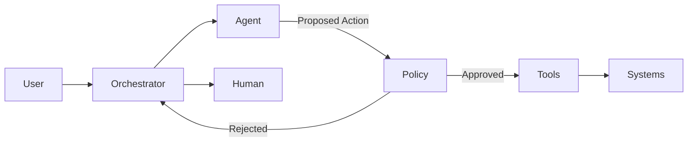

# Article 4 — Agent Patterns  
## Bounded Autonomy in Enterprise AI

---

> **Start here (Agent Patterns):**  
> - You are reading: **Bounded Autonomy**  
> - Next: [Planner–Executor](./planner-executor.md)  
> - Also: [Human-in-the-Loop (HITL)](./human-in-the-loop.md)

## Why this document exists
“Agent-based AI” is one of the most misunderstood concepts in enterprise systems.

In many implementations, agents are introduced as:
- autonomous actors
- long-running workflows
- systems that decide and act independently

In regulated environments such as healthcare, **unbounded autonomy is not innovation — it is risk**.

This document defines **bounded autonomy** as an architectural pattern that allows AI agents to assist, reason, and coordinate actions **without exceeding explicit decision authority**.

---

## Problem being addressed
Healthcare AI assistants are expected to:
- reason across multiple steps
- interact with several systems
- adapt to incomplete or ambiguous input

At the same time, they must:
- respect PHI boundaries
- avoid unauthorized actions
- remain auditable
- escalate correctly when risk increases

Without architectural constraints, agent systems tend to:
- accumulate hidden authority
- bypass policy enforcement
- create non-reproducible behavior
- fail silently

This article explains how **agent behavior is constrained by design**, not by intent.

---

## What an “agent” means in this architecture
In this reference architecture, an agent is defined as:

> A **reasoning component** that can propose actions, request tools, and coordinate multi-step flows **within explicitly defined limits**.

An agent is **not**:
- a system of record
- an autonomous decision-maker
- a replacement for business workflows
- a long-running background process with unchecked permissions

This definition intentionally narrows the scope of what “agent” means.

---

## The principle of bounded autonomy
Bounded autonomy is enforced through **four architectural boundaries**:

1. Scope boundaries  
2. Action boundaries  
3. Data boundaries  
4. Escalation boundaries  

Each boundary exists to control a specific failure mode.

---

## 1. Scope boundaries
**Why this boundary exists**  
Without scope constraints, agents tend to generalize beyond their intended purpose.

**Architectural decision**
- Each agent operates only within a predefined intent domain.
- Cross-domain reasoning requires orchestration approval.

**Example**
A “claims assistance” agent may explain claim status but cannot initiate appeals.

---

## 2. Action boundaries
**Why this boundary exists**  
Reasoning does not imply execution authority.

**Architectural decision**
- Agents may *request* actions.
- Only the orchestration + policy layers may *approve and execute* actions.

**Example**
An agent may request “create case”, but cannot create one directly.

---

## 3. Data boundaries
**Why this boundary exists**  
Agents must not infer or fabricate transactional truth.

**Architectural decision**
- Agents access transactional data only through approved tools.
- Knowledge retrieval (RAG) is restricted to explanatory contexts.

**Example**
An agent may retrieve a denial reason code, but explanations are sourced separately and cited.

---

## 4. Escalation boundaries
**Why this boundary exists**  
AI confidence is not a reliable proxy for correctness or risk.

**Architectural decision**
- Confidence thresholds and intent classification determine escalation.
- Certain intents always require human involvement.

**Example**
Appeals, grievances, or coverage disputes escalate regardless of agent confidence.

---

## Agent execution flow (conceptual)

---

## Tool allowlist rules (example)
Tool access must be enforced **outside the LLM** via a deterministic mapping.

| Intent category | Allowed tools | Approval required | Notes |
|---|---|---:|---|
| Policy / benefits explanation | RAG / KB search only | No | No SoR calls; cite sources |
| Claim status lookup | Claims Read API | No (if policy allows) | Read-only; must show evidence |
| Eligibility verification | Eligibility Read API | No (if policy allows) | Read-only; PHI controls still apply |
| Create case / ticket | Case Create API | Yes | Guarded execution (HITL) |
| Appeal / grievance | None directly | Yes (mandatory) | Always HITL; supervised response |
| Update member data | None directly | Yes (mandatory) | High risk; dual-control recommended |
| Payment / financial action | None directly | Yes (mandatory) | Block by default |

**Enforcement rule:** if an intent has no allowlisted tool, the orchestrator must block execution and escalate.
