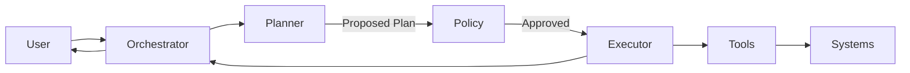

# Article 5 — Agent Pattern  
## Planner–Executor for Controlled Multi-Step Reasoning

---

## Why this document exists
As AI assistants evolve beyond single-turn interactions, they are increasingly expected to:

- reason across multiple steps
- interact with several enterprise systems
- adapt plans based on intermediate outcomes

When this logic is embedded directly inside a single AI reasoning loop, systems become:
- opaque
- difficult to debug
- impossible to audit
- fragile under failure

This document introduces the **Planner–Executor agent pattern** as a way to support complex workflows **without sacrificing determinism, control, or accountability**.

---

## Problem being addressed
In healthcare environments, many user requests appear simple but require coordinated actions:

- checking eligibility
- validating coverage rules
- retrieving claim details
- summarizing outcomes
- escalating when exceptions occur

If an AI agent is allowed to:
- plan and execute actions in the same loop
- dynamically decide next steps without oversight

then failures become:
- non-reproducible
- difficult to trace
- legally risky

This pattern separates **thinking** from **doing**.

---

## What the Planner–Executor pattern is
In this architecture, the pattern is defined as:

> A separation between an AI component that **plans** a sequence of actions and a controlled system that **executes** those actions under policy enforcement.

The planner reasons.  
The executor acts.

Neither operates independently.

---

## Why separation is necessary
Planning and execution fail differently:

- planning errors are conceptual
- execution errors are operational

Conflating the two:
- hides root causes
- increases blast radius
- allows unreviewed autonomy

Separating them allows each failure mode to be **detected, constrained, and audited independently**.

---

## Planner responsibilities (WHY-focused)

**Why the planner exists**
Complex requests require decomposition before action is taken.

**Responsibilities**
- interpret user intent
- propose a step-by-step plan
- identify required tools or data sources
- declare assumptions and dependencies

**Explicit non-responsibilities**
- executing actions
- accessing enterprise systems
- bypassing policy checks

The planner proposes. It does not act.

---

## Executor responsibilities (WHY-focused)

**Why the executor exists**
Enterprise systems require deterministic, governed interactions.

**Responsibilities**
- validate planned steps against policy
- execute approved actions in sequence
- handle retries, timeouts, and partial failures
- return structured results for review

**Explicit non-responsibilities**
- altering the plan
- making business decisions
- interpreting ambiguous intent

The executor acts. It does not reason.

---

## Interaction flow (conceptual)

