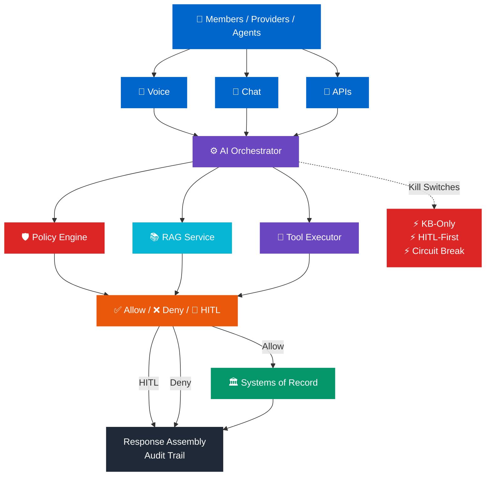

# AI Reference Architecture Diagram

## System Overview



---

## Layer Breakdown

### 1. Entry Points (Users & Channels)
- **Voice:** Real-time audio interaction
- **Chat:** Text-based dialogue
- **APIs:** System integration

### 2. Orchestrator & Control Plane
Central hub that:
- Routes requests to appropriate control planes
- Manages state and context
- Enforces policy decisions
- Controls escalation logic
- Activates kill switches (KB-only, HITL-first, circuit breakers)

### 3. Control Planes (Parallel Processing)

#### Policy Engine (🛡️ Guard)
- **Intent classification** — What is the user asking?
- **Allow/Deny rules** — Is this request permitted?
- **PHI boundaries** — Protect sensitive data
- **Rate limits** — Prevent abuse

#### RAG Service (📚 Knowledge)
- **Approved sources** — Policies, SOPs, FAQs
- **Citation tracking** — Prove where answers come from
- **Retrieval filters** — Only surface relevant content
- **Search engines** — Find the right knowledge

#### Tool Executor (🔧 Execution)
- **Tool registry** — What tools are available?
- **Schema validation** — Is the request valid?
- **Scoped credentials** — Least privilege access
- **Error handling** — Graceful degradation

### 4. Decision Outcomes

Three paths emerge from policy decisions:

| Decision | Action | Next Step |
|----------|--------|-----------|
| **Allow** ✅ | Execute tool | Query Systems of Record |
| **HITL Required** 👤 | Escalate to human | Wait for approval |
| **Deny** ❌ | Block request | Respond with policy reason |

### 5. Systems of Record (🏛️ Authority)
- Claims, Eligibility, Authorization, Provider Data
- **Single source of truth** for transactional data
- Never inferred; always retrieved
- Access controlled by policy engine

### 6. Response Assembly & Audit Trail
All paths converge to:
- **Evidence-based response** — Only facts from SoR + RAG
- **Full traceability** — Every decision logged
- **Compliance proof** — Regulatory requirements met

---

## Core Principles

| # | Principle | Why |
|---|-----------|-----|
| **①** | **AI proposes → Policy decides → Tools execute → Audit logs** | Separates reasoning from enforcement |
| **②** | **Evidence-first: SoR truth > Hallucination** | Prevents confident wrong answers |
| **③** | **HITL gates for high-risk intents** | Humans have authority over AI |
| **④** | **Audit-first: Every decision traced** | Compliance and accountability |

---

## Kill Switches (Emergency Controls)

**⚡ KB-Only Mode**
- Disable transactional tools
- Retrieval-only responses
- Use case: Injection spike, cost runaway

**⚡ HITL-First Mode**
- All actions require human approval
- Still answer questions, but no execution
- Use case: Policy bypass suspected

**⚡ Circuit Breaker**
- Disable failing tool temporarily
- Fallback to other tools
- Use case: Tool outage

**⚡ Intent Blocklist**
- Disable specific intent categories
- Use case: Known attack pattern detected

---

## Example Flow: Claim Status Query

```
User (Chat): "What's the status of claim #12345?"
     ↓
Orchestrator: Route to policy + RAG + tools
     ↓
Policy Engine: Intent = "Claim Status" (Medium risk) → Allow
     ↓
Tool Executor: Query Claims Read API with scoped token
     ↓
Systems of Record: Returns claim status
     ↓
Response Assembly:
  - Status from SoR (evidence-backed)
  - Optional explanation from RAG (e.g., "what does this status mean?")
  - Citation to SoR query
     ↓
Audit Trail: Full trace logged (user, intent, policy decision, tool call, response)
     ↓
Response: "Claim #12345 is APPROVED. Processed on 2026-04-08."
```

---

## Comparison: What This IS vs ISN'T

### ✅ What This Architecture IS:
- Policy-first: controls enforce outside the LLM
- Evidence-based: SoR truth beats inference
- Bounded: AI has clear authority limits
- Auditable: every decision is traceable
- Enterprise-ready: PHI, compliance, degrade modes

### ❌ What This Architecture ISN'T:
- A system-of-record (uses them, doesn't replace them)
- Fully autonomous (HITL gates for high-risk)
- Prompt-based governance (policy engine is code)
- Simple (complexity buys safety & compliance)

---

## Deployment Model

This architecture is designed for:
- **Regulated domains** (healthcare, finance, insurance)
- **Multi-user systems** (members, providers, admins)
- **Real-time channels** (voice, chat)
- **Asynchronous workflows** (batch, scheduled)
- **High-stakes interactions** (coverage, claims, clinical)

Not designed for:
- Autonomous decision-making in high-risk domains
- Replacing system-of-record truth
- Single-user consumer applications (different risk model)

---

## Further Reading

See `07-operating-model/operating-model-and-change.md` for:
- RACI (who owns what)
- Change control (prompts, tools, policies, models)
- Incident playbooks (PHI leak, policy bypass, tool failure)
- Release gates and canary rollout

