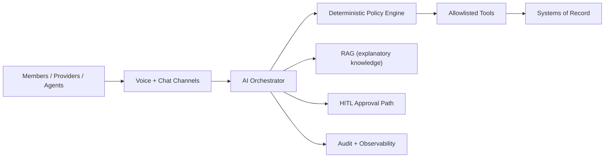

# AI Reference Architecture - Healthcare Voice & Chat Assistant

This repository provides a **practical, enterprise-ready reference architecture** for building a regulated-domain AI assistant (voice + chat) with **governed agent behavior**, **tool-based system access**, **RAG for explanatory knowledge**, and **audit-first observability**.

## Start Here
- **What this repo is:** vendor-neutral architecture guidance for bounded autonomy, policy enforcement, and audit-first operations.
- **Read first:** [README-executive-summary.md](./README-executive-summary.md), [00-overview/architecture-placemat.md](./00-overview/architecture-placemat.md), [00-overview/architecture-decisions.md](./00-overview/architecture-decisions.md), [02-governance/ai-threat-model.md](./02-governance/ai-threat-model.md).
- **Companion implementation repo:** `ai-reference-implementation` (public URL intentionally added during release hardening).

## Repo Boundaries
- This repo defines the vendor-neutral reference architecture: principles, patterns, governance policies, and diagrams.
- Full implementation (including runnable sample code) belongs in the companion repo: ai-reference-implementation.
- This repo keeps standards/specs only (e.g., tool contract standard + schemas) and vendor-neutral architecture artifacts.

## Doc Conventions
- Use vendor-neutral language and generic examples only.
- Keep architecture guidance implementation-agnostic unless explicitly marked as a reference flow.
- Use relative links for internal references.
- Keep PHI/PII out of examples and sample artifacts.

## Who this is for
- Enterprise architects and platform engineers
- Security/compliance stakeholders
- Product teams building customer support / internal assistant experiences in regulated environments (e.g., healthcare)

## Architecture Snapshot

## How to read this repo (recommended order)
1. **Executive summary:** [README-executive-summary.md](./README-executive-summary.md)
2. **Placemat (one-page):** [00-overview/architecture-placemat.md](./00-overview/architecture-placemat.md)
3. **Architecture decisions (ADR-lite):** [00-overview/architecture-decisions.md](./00-overview/architecture-decisions.md)
4. **Glossary:** [00-overview/glossary.md](./00-overview/glossary.md)
5. **Scope & principles:** [00-overview/scope-and-principles.md](./00-overview/scope-and-principles.md)
6. **Release checklist:** [00-overview/release-checklist.md](./00-overview/release-checklist.md)
7. **C4 Context:** [01-context/c4-context.md](./01-context/c4-context.md)
8. **C4 Container:** [02-container/c4-container.md](./02-container/c4-container.md)
9. **Governance (policies + threats):**
   - [02-governance/ai-threat-model.md](./02-governance/ai-threat-model.md)
   - [02-governance/tool-registry-policy.md](./02-governance/tool-registry-policy.md)
10. **Data strategy (RAG vs Systems of Record):** [03-data-strategy/rag-vs-systems-of-record.md](./03-data-strategy/rag-vs-systems-of-record.md)
11. **Agent patterns:**
   - [04-agent-patterns/bounded-autonomy.md](./04-agent-patterns/bounded-autonomy.md)
   - [04-agent-patterns/planner-executor.md](./04-agent-patterns/planner-executor.md)
   - [04-agent-patterns/human-in-the-loop.md](./04-agent-patterns/human-in-the-loop.md)
12. **Security posture (prompt injection):** [04-security/prompt-injection-posture.md](./04-security/prompt-injection-posture.md)
13. **Evaluation & observability:** [05-evaluation-observability/evaluation-and-observability.md](./05-evaluation-observability/evaluation-and-observability.md)
14. **Security & compliance:** [06-security-compliance/security-and-compliance.md](./06-security-compliance/security-and-compliance.md)
15. **Operating model & change:** [07-operating-model/operating-model-and-change.md](./07-operating-model/operating-model-and-change.md)

> Note: Folder numbering groups topics by reading order; some numbers repeat intentionally (e.g., `02-container` vs `02-governance`).

* **Interview kit:** `08-interview-kit/5-slide-deck-script.md`
* **Reference implementation (code):** see companion repo `ai-reference-implementation/reference-implementation/`

## Repository structure
- `00-overview/` - scope, non-goals, principles
- `01-context/` - C4 Context diagram and boundaries
- `02-container/` - C4 Container diagram and platform building blocks
- `02-governance/` - threat model + governance policies
- `03-data-strategy/` - RAG vs Systems of Record stance and governance
- `04-agent-patterns/` - bounded autonomy, planner-executor, HITL controls
- `04-security/` - prompt injection posture and security guidance
- `05-evaluation-observability/` - quality, monitoring, tracing, evaluation
- `06-security-compliance/` - PHI controls, RBAC, auditing, retention, threat model
- `07-operating-model/` - rollout, enablement, change management, ownership
- `08-interview-kit/` - interview-ready artifacts (scripts, decks)
- `reference-implementation/` - standards/specs only (code lives in ai-reference-implementation)

## What's NOT in scope (non-goals)
- Replacing systems-of-record or becoming a transactional source of truth
- Allowing autonomous high-risk actions without explicit approval
- Storing PHI in vector stores (unless explicitly approved and controlled)
- Building a full workflow engine (the assistant integrates with existing workflows)

## Design stance (in one paragraph)
The assistant is **not** a system-of-record and does **not** "do things by itself." It proposes actions, but **policy gates and allowlisted tools** control execution; **RAG is used for explanatory knowledge**; and **human escalation** is mandatory for high-risk intents. Every decision is **traceable and auditable**.

## Production-ready (minimum bar)
- Tool access is allowlisted and enforced outside the LLM
- High-risk intents require HITL or explicit approval gates
- Prompts, tool calls, and policy decisions are trace-logged for audit
- Safety controls exist (PII/PHI redaction, jailbreak detection, policy denies)
- Evaluation and operational metrics are defined and monitored (SLOs + guardrail signals)
